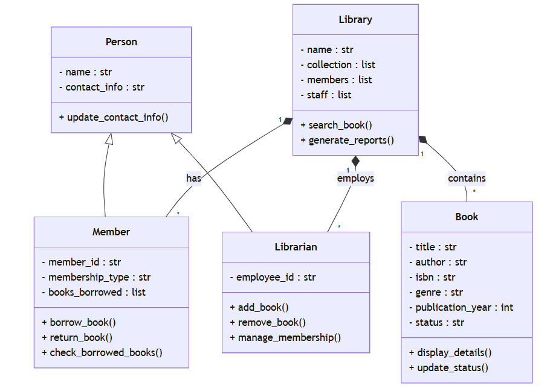

# OOP-Advanced-Library-Management-System
This repo contains the code for a mini-project to practice &amp; master OOP in python

**Problem Statement: Advanced Library Management System**

**Aim:** Design a comprehensive Object-Oriented Python application for a modern library management system that demonstrates advanced OOP principles and real-world software design practices.

Detailed Requirements:

1. Core Entities and Inheritance:
   - Implement a base `Person` class with common attributes like name and contact information
   - Create `Member` and `Librarian` classes that inherit from `Person`
   - Each class should have unique methods and attributes specific to their role

2. Member Management:
   - Implement different membership types (e.g., Standard, Premium, Student)
   - Create a membership system with:
     * Borrowing limits based on membership type
     * Membership duration and renewal mechanisms
     * Late return penalty calculation
     * Membership status tracking (active, suspended, expired)

3. Book Management:
   - Design a robust `Book` class with comprehensive book information
   - Implement book status tracking (available, borrowed, reserved, damaged)
   - Create methods for:
     * Checking book availability
     * Updating book status
     * Generating detailed book reports
     * Implementing genre-based categorization

4. Library Operations:
   - Develop a `Library` class that manages the entire library ecosystem
   - Implement advanced search functionality:
     * Search by multiple criteria (title, author, genre, publication year)
     * Implement fuzzy search capabilities
   - Create reporting mechanisms:
     * Most borrowed books
     * Member activity reports
     * Book inventory status

5. Advanced OOP Concepts to Implement:
   - Multiple inheritance
   - Method overriding
   - Composition and aggregation
   - Abstract base classes
   - Class and static methods
   - Property decorators
   - Exception handling for library-specific scenarios

6. Additional Challenging Features:
   - Implement a reservation system for books
   - Create a recommendation engine based on member's borrowing history
   - Design a fine calculation system with progressive penalty rates
   - Implement a simple authentication mechanism for members and staff

Bonus Challenges:
- Create a logging system for all library transactions
- Implement data persistence (saving and loading library state)
- Design a simple GUI or command-line interface for interaction

Learning Outcomes:
By implementing this system, you'll practice:
- Designing complex class hierarchies
- Managing relationships between classes
- Implementing advanced Python OOP techniques
- Handling real-world scenarios through object-oriented design
- Creating modular and extensible code

Suggested Development Approach:
1. Start with base classes and their core functionality
2. Gradually add more complex methods and interactions
3. Implement error handling and edge cases
4. Refactor and optimize your design
5. Add additional features incrementally

This problem statement covers almost all aspects of OOP in Python, providing you with a comprehensive, real-world scenario to practice and master object-oriented programming concepts.

Would you like me to elaborate on any specific aspect of this problem statement or provide guidance on how to approach its implementation?
